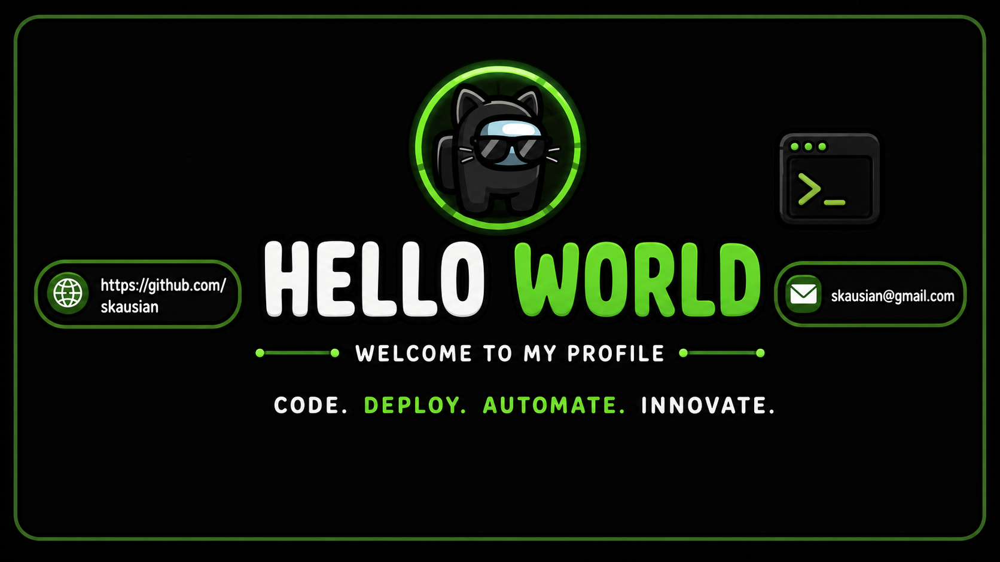
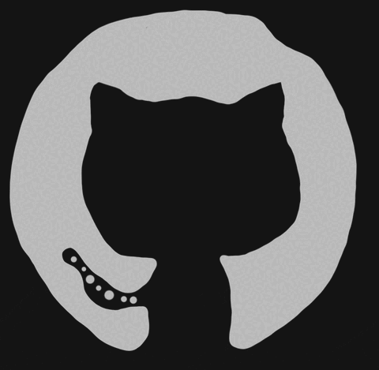

 

 
 

I am a **Computer Science undergraduate at IIT** who is passionate about **DevOps, Cloud, Backend Development, and Full Stack Engineering**.

I enjoy building real-world projects, learning how applications are deployed, and understanding how modern systems run in production.

- 🎓 Computer Science Undergraduate @ IIT  
- 🚀 Learning DevOps, Cloud, CI/CD, and Automation  
- 🐳 Exploring Docker, GitHub Actions, AWS, and Linux  
- 💻 Building full-stack and backend projects  
- 🧠 Interested in AI-powered applications and real-world problem solving  
- ⚡ Keep learning everyday  

 

 

## 📬 Contact Me

&nbsp;&nbsp;

&nbsp;&nbsp;

## 🧰 Tech Stack & Current Learning

<table>
<tr>
<td width="58%" align="center">

### Languages & Tools

 
 

 
 

</td>

<td width="42%">

### Current Learning

- Deepening my knowledge in **DevOps Engineering**
- Learning **Docker** and containerized deployment
- Building **CI/CD pipelines** using GitHub Actions
- Exploring **AWS cloud deployment**
- Improving backend skills with **Spring Boot**
- Practicing Linux, Git, and production-style workflows

### My Focus

- Clean code  
- Real-world projects  
- Strong GitHub portfolio  
- Better system thinking  
- Continuous learning  

</td>
</tr>
</table>

## 📊 GitHub Analytics

 
 

### ⚡ Keep learning. Keep building. Keep improving.

